# Portfolio Analysis
In this section, you will calculate and visualize performance and risk metrics for the portfolios.

## Performance of portfolio

The plot shown displays the the daily return of the portfolios.

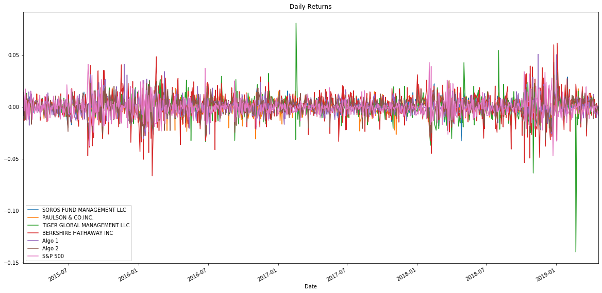

### Cummulative Return

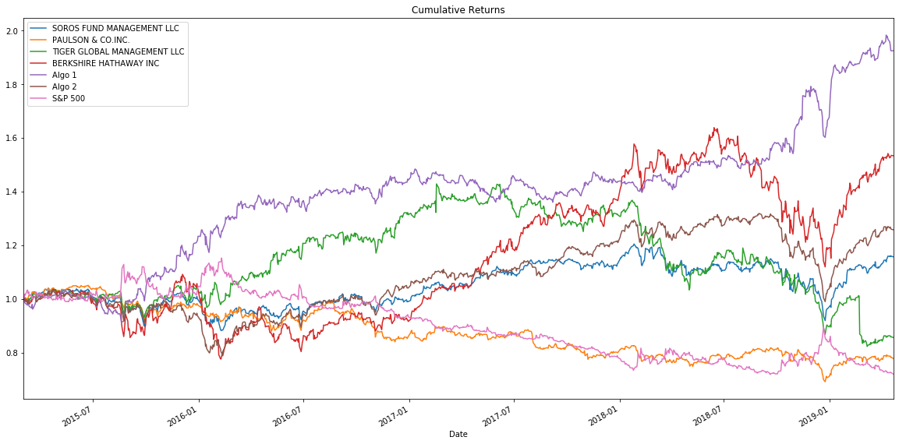

### Box plot to visually show risk

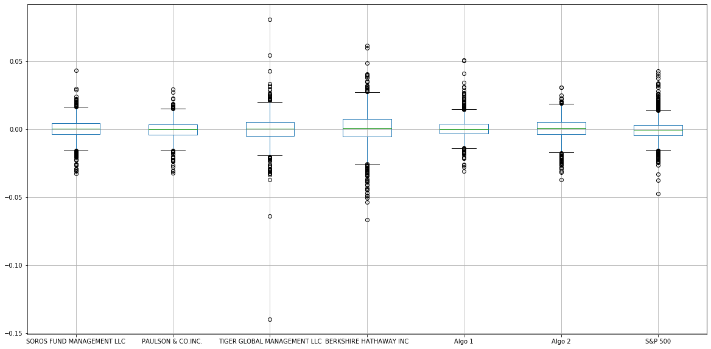

### Rolling standard deviation for the S&P 500 using a 21 day window

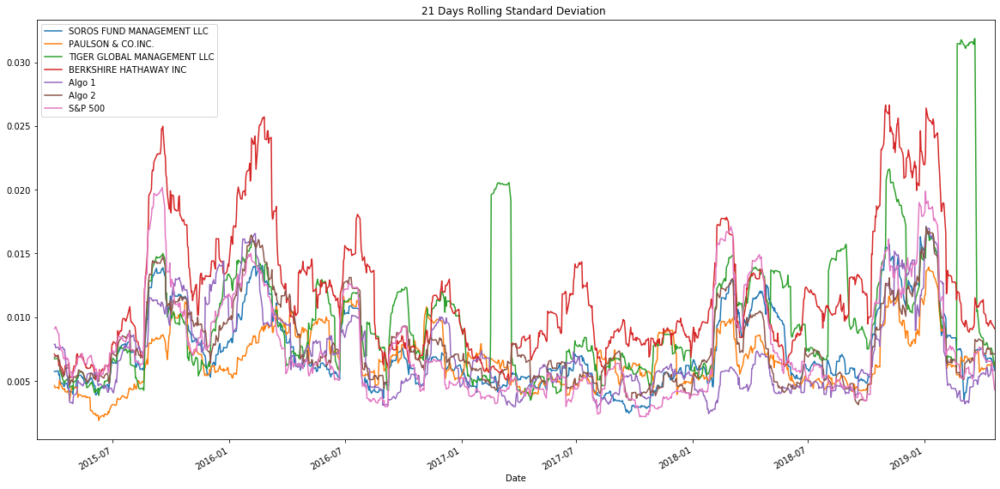

### Correlation

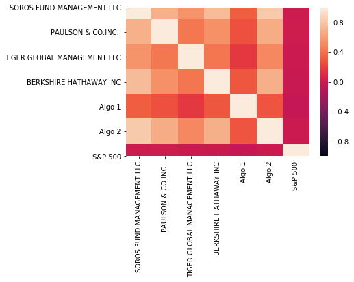

### Beta for a single portfolio compared to the total market (S&P 500)

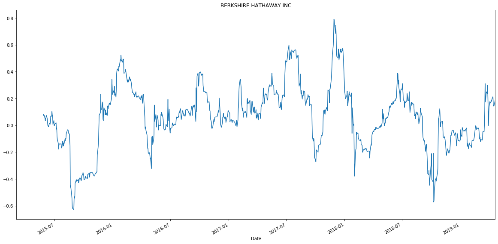

### Exponentially Weighted Average

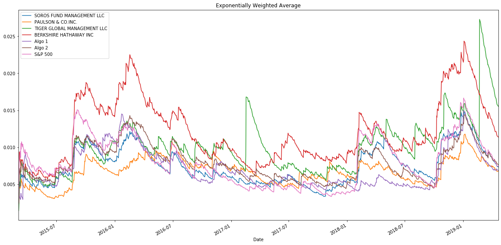

### Annualzied Sharpe Ratios

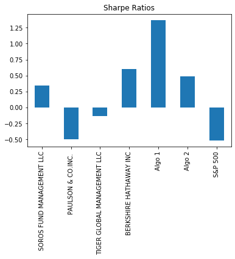

Will go with BERKSHIRE HATHAWAY INC since it has lower risk

## Performance and risk analysis with your portfolio to see how it compares to the others stocks

### 21 days Rolling

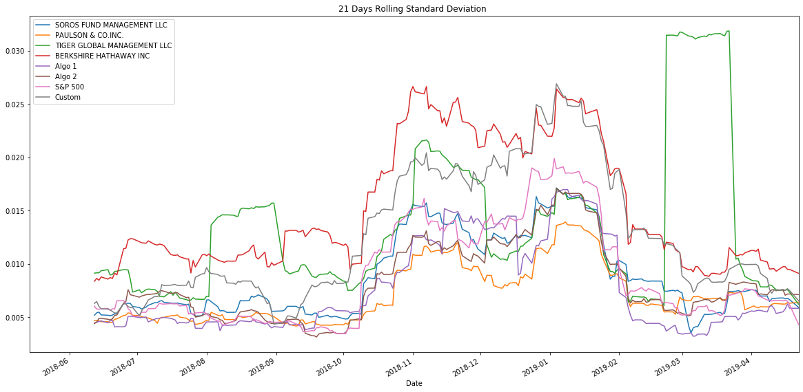

### Beta with other stocks

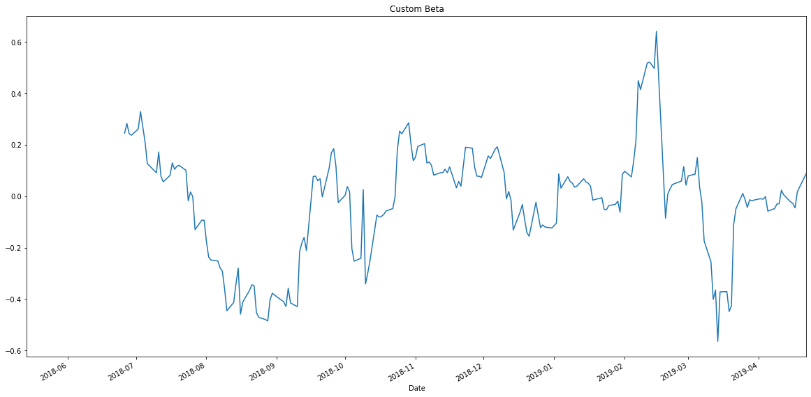

### Annualzied Sharpe Ratios

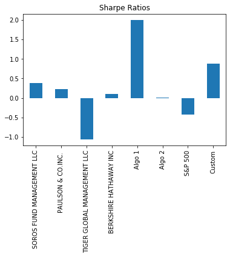

### Include correlation analysis to determine which stocks (if any) are correlated

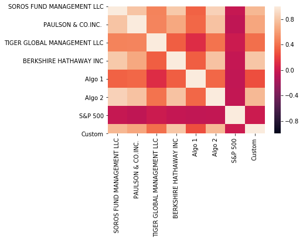